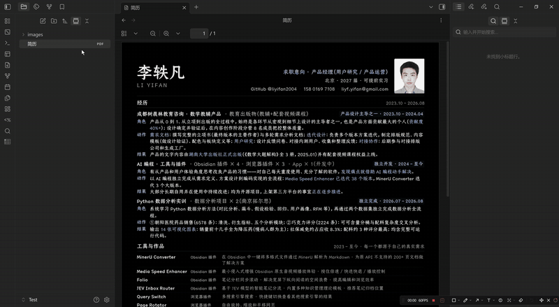
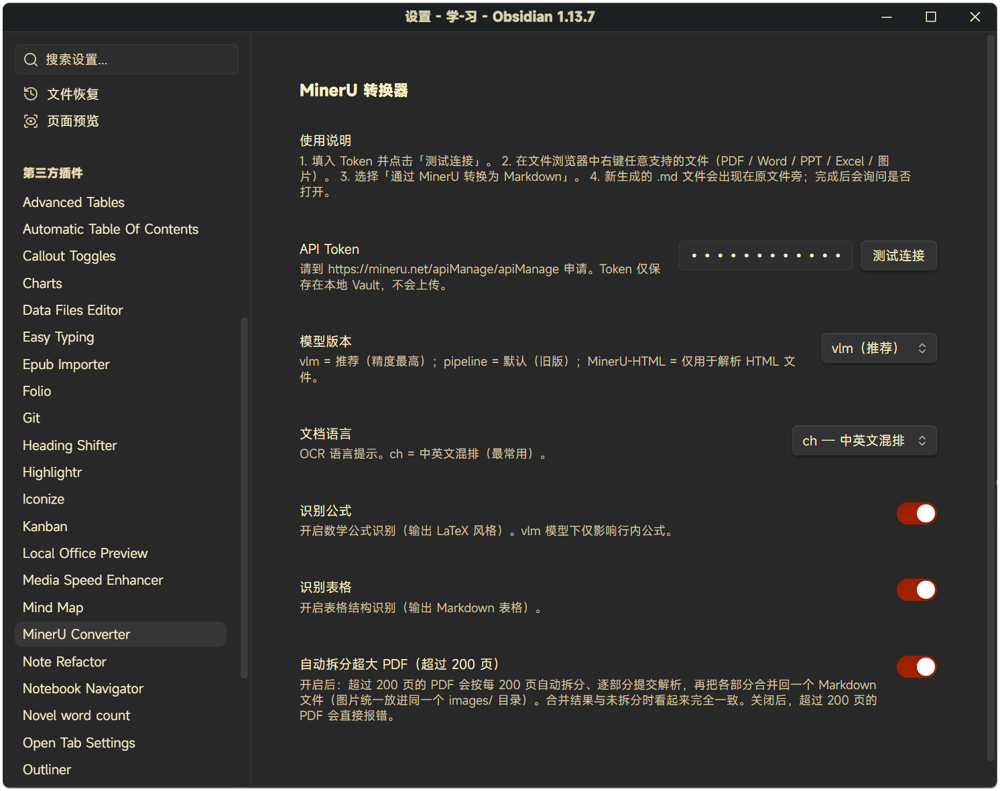

<p align="center">
  
</p>

# obsidian-mineru

[](LICENSE)
[](https://github.com/liyifan2004/obsidian-mineru-converter/releases)

[English](README.md) | 简体中文

> 让 MinerU 的精准解析 API 与 Obsidian 协同工作：右键一下，把库里的任意 PDF / Word / PPT / Excel / 图片转换成可编辑的 Markdown。

本仓库包含 **MinerU Converter** Obsidian 插件，以及它背后的工程笔记与工具。

## 目录

| 目录 | 内容 |
|---|---|
| [`plugin/`](plugin/) | Obsidian 插件本体（TypeScript → 打包为 `main.js`），开箱即用。 |
| [`docs/01-API文档理解.md`](docs/01-API文档理解.md) | MinerU v4 API 的结构化理解——每个端点、参数、状态机与错误码。 |
| [`docs/02-实操经验总结.md`](docs/02-实操经验总结.md) | 踩坑实录：速率限制、CDN SSL 问题、200 页上限、加密 PDF、代理陷阱、批量处理。 |
| [`docs/03-Obsidian插件开发规划.md`](docs/03-Obsidian插件开发规划.md) | 本插件的产品规划 + 技术设计 + 交互设计。 |
| [`code/`](code/) | 先于插件存在的 Python 工具（252 文件批量转换器）。需要处理超大库时有用。 |

## 快速上手（Obsidian 插件）

1. 在 <https://mineru.net/apiManage/apiManage> 申请 MinerU API token（有免费额度）。
2. 在 Obsidian → **设置 → 第三方插件 → MinerU Converter** 中粘贴 token，点 **Test connection** 验证。
3. 在文件列表中右键任意 PDF / Word / PPT / Excel / 图片 → **Convert to Markdown via MinerU**。
4. 转换出的 `.md` 文件会出现在原文件旁边，插件会询问是否打开。

**超过 200 页的 PDF** 会自动处理：插件把页面树拆成 200 页一份，逐份提交给 MinerU，再把 Markdown 和图片合并回原文件旁的一个 `.md`。产出与非拆分转换完全一致——没有分段标记，共用一个 `images/` 目录。可在 **Settings → MinerU Converter → Auto-split oversized PDFs** 中关闭。

支持格式与限制见 [docs/03-Obsidian插件开发规划.md](docs/03-Obsidian插件开发规划.md)。

## 演示

右键一个 PDF，等几秒，拿到 Markdown：



**设置页**——API token、模型版本、OCR 语言、公式/表格识别、超长 PDF 自动拆分：



## 快速上手（Python 批量工具）

如果有成百上千个文件要转，插件的逐文件流程太慢。改用 [`code/`](code/) 里的 Python 工具：

```bash
pip install requests PyPDF2
# 编辑 code/mineru_convert.py 顶部的 TOKEN 和 ROOT_DIR
python code/mineru_convert.py
```

脚本自动分批（每批 40 个文件，批间隔 70 秒以遵守 MinerU 的 50 次/分钟限制），支持断点续传，`.md` 原地生成。

## 插件开发

```bash
cd plugin
npm install
npm run dev   # watch 模式，自动重新构建 main.js
```

本地测试：把产出的 `main.js`、`manifest.json`、`styles.css` 复制到 `<your-vault>/.obsidian/plugins/obsidian-mineru/`，然后在 Obsidian 设置中启用 **Community plugins → MinerU Converter**。

## License

[MIT](LICENSE)
